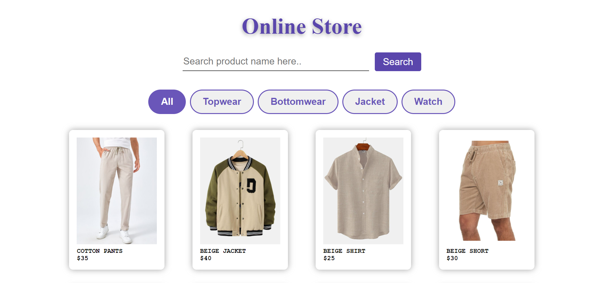
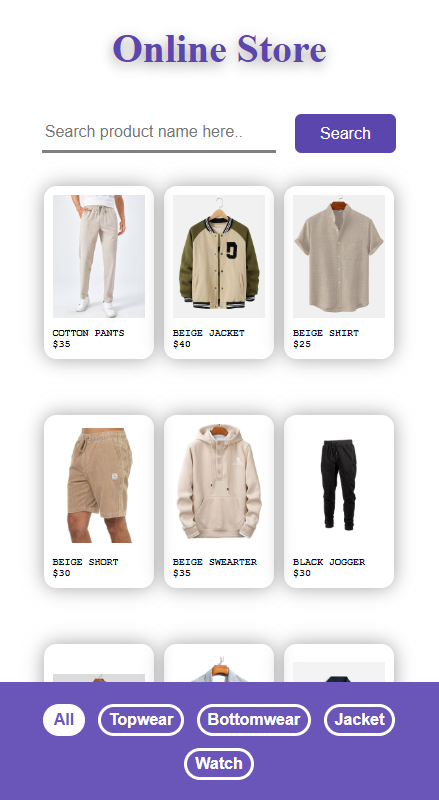

# Onlinde Store App

## Descripción

Esta es una aplicación de una tienda online desarrollada con HTML, Javascript y CSS. Permite a los usuarios navegar por la página a través de los diferentes productos que muestra, pudiendo filtrarlos por categorias o bien hacer uso de la barra de busqueda para ir directo a lo que desean hallar. Este proyecto fue realizado con el objetivo de practicar mis habilidades en desarrollo front-end. 

## Características

- **Buscar productos**: Puedes dirigirte a la barra de busqueda y escribir el nombre (o el precio) del articulo que estas buscando. Este te devolverá aquellos que concuerden con tu entrada.
- **Filtrar productos**: Puedes filtrar los productos por categoría de forma sencilla a través de los botones que se muestran justo debajo de la barra de busqueda en dispositos de escritorio y en la parte inferior de la pantalla para dispositivos móviles.
- **Responsivo**: La aplicación es responsive, por lo que no importa desde que dispositivo se utilice esta se adaptará de forma automatica a cualquier tamaño de pantalla.
- **Interfaz atractiva**: La aplicación cuenta con un diseño visual simple pero agradable utilizando CSS.

## Capturas de Pantalla

### Sitio de escritorio


### Dispositivos móviles


## Instalación

Sigue estos pasos para clonar y ejecutar el proyecto en tu máquina local:

1. Clona el repositorio:
   ```bash
   git clone https://github.com/tu_usuario/tu_repositorio.git

2. Navega hasta la carpeta del proyecto:
    ```bash
    cd tu_repositorio

3. Abre el archivo index.html en tu navegador favorito.

## Uso 

### Buscar artículo
1. Escribe el nombre del artículo o el precio que estes buscando
2. Haz clic en el botón 'Search'
3. Presiona el botón 'All' para volver a mostrar todos los artículos 

### Filtrar por categoría
1. Presiona el botón con el nombre de la categoría de artículos que deseas buscar
2. Presiona el botón 'All' para volver a mostrar todos los artículos 

## Tecnologías Utilizadas 

- HTML
- CSS
- JavaScript

## Autor 

Este proyecto fue desarrollado por Carlos M. Hernández. Si tienes alguna pregunta o sugerencia, no dudes en contactarme.

## Licencia

Este proyecto está licenciado bajo la Licencia MIT - mira el archivo [LICENSE](./LICENSE) para más detalles.